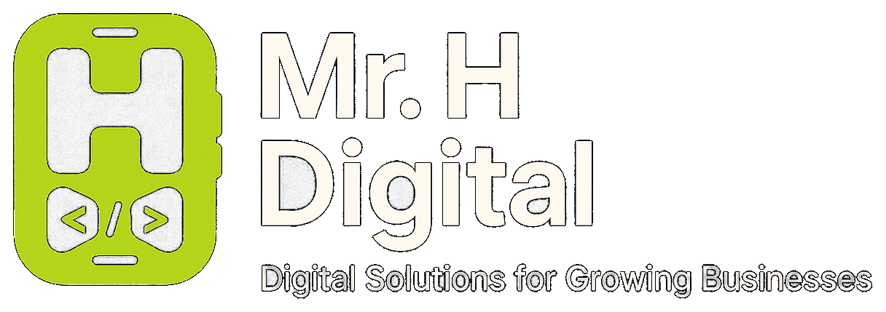

<p align="center">
	
</p>

<h1 align="center">TVECO — Timeline Vehicle Export Company Website</h1>

<p align="center">
	<strong>Professional static website for South Africa's premier vehicle export specialists.</strong>
</p>

<p align="center">
	<a href="https://tveco.co.za">Live Site</a>
	·
	<a href="https://github.com/mr-h-digital/tvec-website/actions">Deployment Workflow</a>
</p>

<p align="center">
	<a href="https://github.com/mr-h-digital/tvec-website/actions">
		
	</a>
	<a href="https://github.com/mr-h-digital/tvec-website/commits/main">
		
	</a>
	<a href="https://github.com/mr-h-digital/tvec-website">
		
	</a>
	<a href="https://github.com/mr-h-digital/tvec-website/blob/main/LICENSE">
		
	</a>
</p>

---

## Overview

This repository contains the official public website for Timeline Vehicle Export Company (Pty) Ltd — South Africa's trusted vehicle export specialists.

It is built as a lightweight static single-page site with:

- A structured, maintainable directory layout
- Responsive mobile-first design system
- Smooth scroll animations and interactive UI components
- WhatsApp-integrated contact and enquiry form

## Highlights

- Branded preloader with orange progress bar and logo pulse animation
- Full-screen hero with Ken Burns zoom effect and animated stat panel
- Animated ticker/marquee strip showcasing core services
- Service cards, process timeline, and why-choose-us section
- Client testimonial grid with star ratings
- Accordion FAQ with Schema.org structured data markup
- WhatsApp enquiry form that composes and sends a structured message
- Floating WhatsApp button with tooltip
- Fully responsive across desktop, tablet, and mobile
- SEO-ready: meta tags, Open Graph, canonical URL, robots.txt, sitemap.xml, structured data

## Technology

- HTML5
- CSS3 (custom properties, grid, animations)
- Vanilla JavaScript (IntersectionObserver, counter animation, scroll spy)

## Project Structure

```text
tvec/
|- index.html
|- 404.html
|- robots.txt
|- sitemap.xml
|- .gitignore
|- css/
|  |- styles.css
|- js/
|  |- main.js
|- assets/
|  |- images/
|  |- videos/
|  |- fonts/
|  |- icons/
|     |- favicon.ico
|     |- favicon-32x32.png
|     |- favicon-16x16.png
|     |- apple-touch-icon.png
|- README.md
```

## Local Setup

No dependencies or build tools required. Open directly in a browser:

```bash
open index.html
```

Or serve locally with any static file server:

```bash
npx serve .
```

## Client Zone Deployment

The client portal app is built from the sibling workspace folder `tveco-invoice-generator-web-ui` and published into this website under `client-zone/`.

Run:

```bash
./scripts/publish-client-zone.sh
```

This script will:

- Build the portal with `VITE_BASE_PATH=/client-zone`
- Use production API defaults (`https://tveco.co.za/api`)
- Copy the generated files into `client-zone/`

Optional overrides:

```bash
TVECO_API_URL=https://tveco.co.za/api \
TVECO_PUBLIC_APP_URL=https://tveco.co.za/client-zone \
./scripts/publish-client-zone.sh
```

## Favicon Setup

Favicon files are referenced in `index.html` but need to be generated and placed in `assets/icons/`.

Generate all variants at [realfavicongenerator.net](https://realfavicongenerator.net) using the TVEC orange logo, then drop the output into `assets/icons/`.

Required files:

- `favicon.ico`
- `favicon-32x32.png`
- `favicon-16x16.png`
- `apple-touch-icon.png`

## Deployment

The site is a static build with no server runtime required. It can be deployed to any static hosting provider:

- **GitHub Pages** — push to `main`, serve from root or `gh-pages` branch
- **Netlify** — connect repo, set publish directory to `/`
- **Vercel** — connect repo, framework preset: Other

Update the following after deployment:

- `robots.txt` — confirm `Sitemap` URL matches live domain
- `sitemap.xml` — confirm `<loc>` URL matches live domain
- `index.html` — confirm `og:url` and `canonical` meta tags match live domain

## Notes

- Some images are loaded from Unsplash CDN. For production, replace with locally hosted files in `assets/images/`.
- WhatsApp number is set to `+27 72 266 3988` (Thabo Seabi).
- Contact emails: `enquiries@tveco.co.za` and `thabo@tveco.co.za`.

## Credits

- Website: Timeline Vehicle Export Company (Pty) Ltd
- Development and branding: Mr. H Digital

---

<p align="center">
	<strong>Development Signature</strong>
</p>

<p align="center">
	
</p>

<p align="center">
	Designed and developed by <a href="https://mrhdigital.co.za" target="_blank" rel="noopener noreferrer"><strong>Mr. H Digital</strong></a>
</p>
